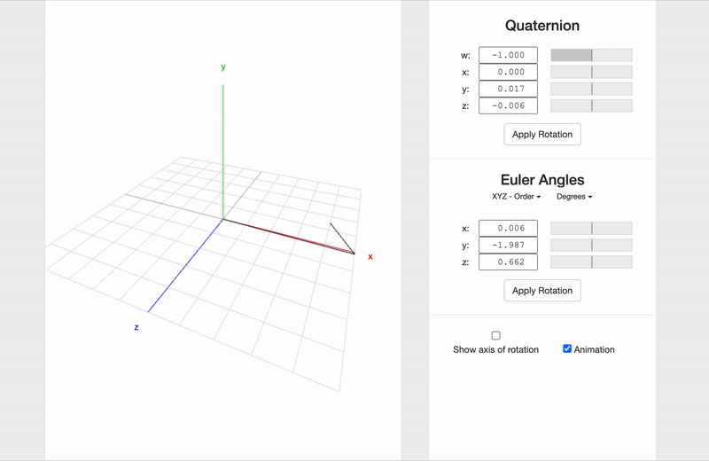

# ROS Euler To Quaternion Conversion Service 

Many times, you will be dumbfounded by ROS's Orientaton calculation in your program or code. 


## [Euler Quaternion Visualization](https://quaternions.online/) 




For an example, some MPC for UAVs may take Euler based orientation to handle movement planning while Gazebo ROS models takes Quaternion based orientation.

## How are you going to make them communicate?
You may use TF transformation package to help you http://wiki.ros.org/tf2.
The resaon I use tf in my example service file is that my set up runs ROS Melodic and my UAV's MPC runs on python3.6 while my ROS package was built with Python2.

In the [Service Python File](rpy_quat_service.py), you can use it as a service server and get results as such: 

```bash
## Please catkin_make or buld the service first and run roscore 
python rpy_quat_service.py

## You will see the following 
[INFO] [1620805001.823235]: Service server has been started
```

``` bash
rosservice call /QuaterniontoRPY "x: 0.0
y: 0.0
z: 0.7957747154
w: 1.0" 
# Response
euler: [0.0, -0.0, 1.3443184674042765]
```

[Learn how to write ROS Service in python](http://wiki.ros.org/ROS/Tutorials/WritingServiceClient%28python%29)
